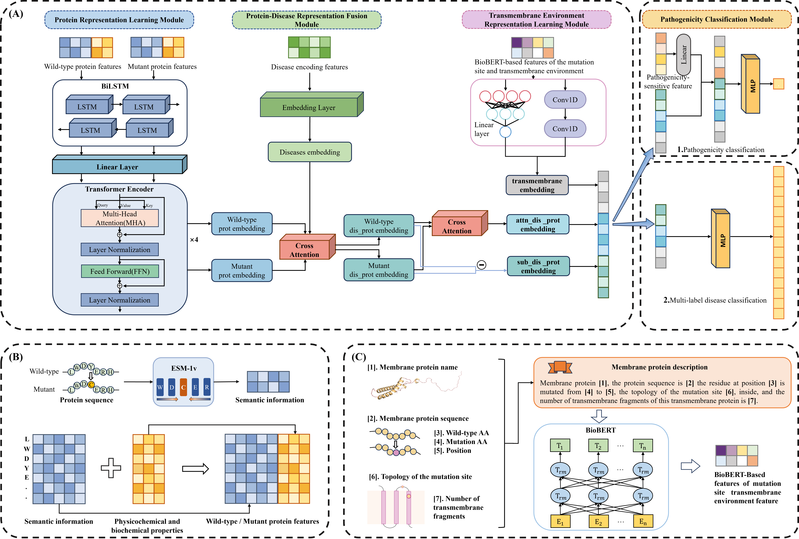

# MutDPAL:Prediction of Pathogenic Mutations in Human Membrane Proteins and Their Associated Diseases via Utilizing Pre-trained Bio-LLMs
## Introduction  
MutDPAL is a novel deep learning approach to predict the pathogenicity of missense mutations in membrane proteins and determine the disease categories of the pathogenic mutation.

## Requirements

* python = 3.8.19   
* cuda = 11.8    
* torch = 2.3.0  
* numpy = 1.24.3  
* scikit-learn = 1.3.2  
* tqdm = 4.66.4  

In case you want to use conda for your own installation please create a new MutDPAL environment.
We showed an example of creating an environment.
```sh
conda create -n MutDPAL python=3.8.19
conda activate MutDPAL
conda install pytorch==2.3.0 pytorch-cuda=11.8 -c pytorch -c nvidia
conda install scikit-learn=1.3.2 
conda install  numpy=1.24.3
conda install  tqdm=4.66.4  
```
Or you can use the provided [environment.yml](./environment.yml) to create all the required dependency packages.
```sh
conda env create -f environment.yml
```

It is also necessary to install two pre-trained models: [ESM-1v](https://huggingface.co/facebook/esm1v_t33_650M_UR90S_1), [BioBert](https://huggingface.co/dmis-lab/biobert-base-cased-v1.1/). We use the pre-trained weights from HuggingFace for prediction. and [TMbed](https://github.com/BernhoferM/TMbed). Please download them to your device and modify the corresponding paths to extraction features.  
## Data Available  
The raw data is stored in the ‘data’ directory, structured as follows:  
* Pathogenicity Prediction Datasets (./raw_data/pathogenicityClassification): PathoClassDS: A novel dataset curated for pathogenicity classification (the total dataset diseases.csv and individual dataset train_dataset_2.csv, val_dataset_2.csv, test_dataset_2.csv).  
* Pred-MutHTP: Benchmark dataset for 10-fold cross-validation, ensuring robust model evaluation (pred_muthtp.csv).
* Disease Classification Dataset (./raw_data/diseaseClassification):  
Derived from pathogenic missense mutations in PathoClassDS, this multi-label dataset (DiseaseClassDS) categorizes variants into 15 disease classes based on the MutHTP database’s annotation framework (the  total dataset dataset_m.csv and individual dataset train_dataset_m.csv, val_dataset_m.csv, test_dataset_m.csv).

## Quick start
1. Download 'features' and 'pred-features'  file and add it to the 'data':

   url： https://drive.google.com/drive/folders/1lTz0hUA8VZ_1h12rx3653XD_QZvnwQpv?usp=sharing

   
2. cd scripts
3. For pathogenic classification task  
```python
cd patho_classification/  
python main.py --mode train  # Model retraining
# or
python main.py --mode test  # Load the saved weights to evaluate the model on test data
```
We have preserved our trained model saved in ./models/patho_model/checkpoint.pth, which can be directly deployed for inference tasks.  
  For 10-fold cross validation on Pred-MutHTP dataset 
```python
python pred-muthtp.py --mode train  # Model retraining  
# or
python pred-muthtp.py --mode test  # Load the saved weights to evaluate the model on holdout-test data
```
We have preserved our trained model saved in ./models/pred-muthtp/log/i(0-9)/log/checkpoint.pth, which can be directly deployed for inference tasks.
4. For multi-label disease classification task  
 ```python
cd dis_classification/  
python main.py --mode train
# or
python main.py --mode test
```
We have preserved our trained model saved in ./models/multi_model/checkpoint.pth, which can be directly deployed for inference tasks.
## Results in manuscript
Our comparative analysis includes the following key findings:
1. Pathogenicity Prediction Performance  
* Comprehensive evaluation on our novel PathoClassDS benchmark (provided in ./results/patho_result/patho_results.csv) and MutDPAL’s pathogenicity ouput result(provided in ./results/patho_result/result_2.txt)
* Robust 10-fold cross-validation results using the Pred-MutHTP dataset (.results/pred-muthtp/pred-muthtp.csv) and MutDPAL’s pathogenicity ouput result (provided in ./results/ pred-muthtp/test_result.txt)

2. Disease Classification Capabilities  
Multi-label classification performance across 15 disease categories, with complete results available in ./results/multi_result/multi_results.csv and MutDPAL’s multi-label ouput result (provided in ./results/multi_result /result_m.txt)

## Contacts  
Any more questions, please do not hesitate to contact me: 20234227054@stu.suda.edu.cn
